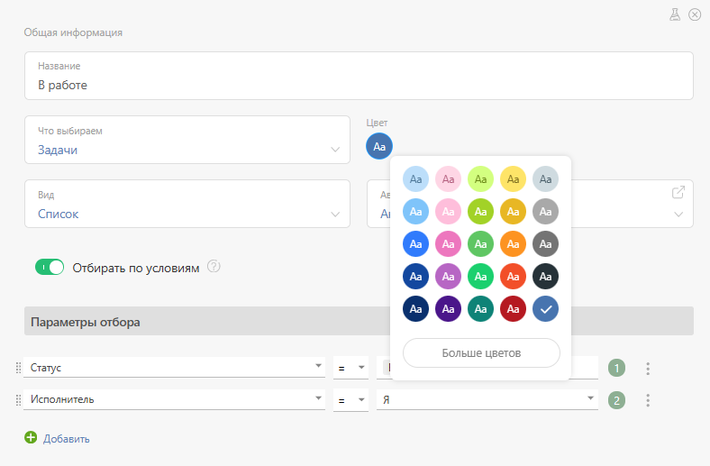
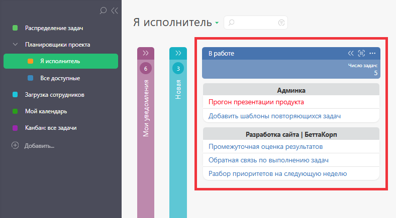

Цвет заголовка списка в настройках [списков Планировщика](Виды_списков_планировщика.md "Виды списков планировщика") позволяет выбрать один из доступных цветов, в которые будет окрашен заголовок настраиваемого списка: 

  

Вот так выглядит список планировщика с выбранным цветом заголовка: 

  

Выбор цвета заголовков списков является одним из инструментов [управления внешним видом Планировщика](Управление_внешним_видом_планировщика.md "Управление внешним видом планировщика") и позволяет создавать удобные и визуально привлекательный рабочие пространства для различных целей.
