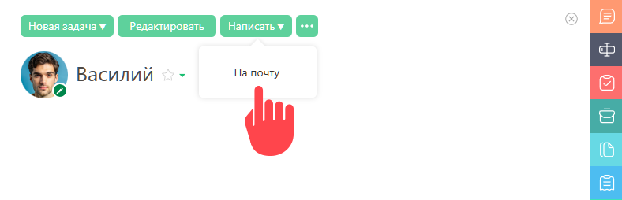

В [ карточке контакта](Карточка_контакта.md "Карточка контакта") есть возможность написать ему сообщение по электронной почте: 

  

Аналогичная возможность есть в [ фильтрах контактов](Фильтры_контактов.md "Фильтры контактов"). По клику на e-mail контакта появляется выпадающее меню, содержащее в том числе и опцию отправки письма из ПланФикса. 

В соответствии с [идеологией ПланФикса](https://planfix.ru/ideologiya/) сообщение на e-mail контакта представляет собой [ задачу](Задачи.md "Задачи"). Контакт получает ее в виде обычного письма, а пользователь ПланФикса может использовать для работы с ней все инструменты системы. 

Настройка **Шаблон задачи для отправки сообщения на e-mail контакта** позволяет выбрать [ шаблон](Шаблоны_задач.md "Шаблоны задач"), по которому будут создаваться такие задачи-сообщения: 

  * Если выбран **стандартный шаблон** (настройка по умолчанию), при создании задачи-сообщения будет использоваться урезанная форма, содержащая минимум полей.

  * Если выбран другой шаблон, он будет отображаться в обычном полном виде.

## Полезно

  * При желании вы можете сразу при создании письма-сообщения вводить данные в дополнительные поля и использовать их в письме, которое получит этот контакт. Для этого помимо выбора нужного шаблона задачи в этой настройке, настройте соответствующим образом [ шаблон письма](Шаблоны_писем-уведомлений_для_контактов_без_доступа_в_ПланФикс.md "Шаблоны писем-уведомлений для контактов без доступа в ПланФикс"), добавив в него переменные, соответствующие этим полям.
