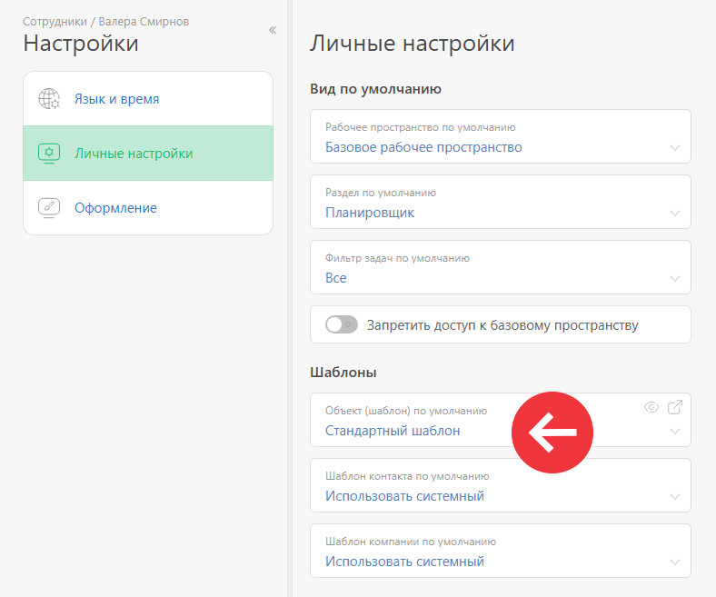
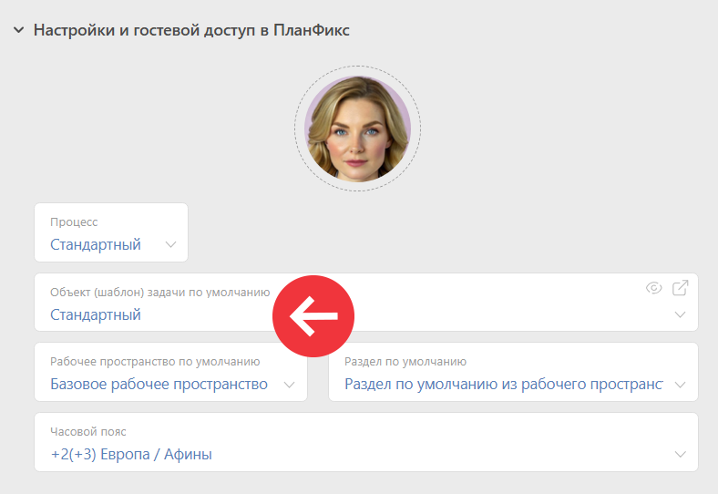
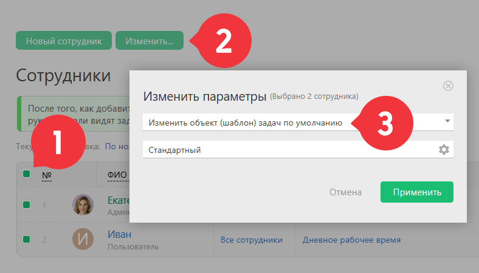

В [ настройках карточки сотрудника](Настройки_в_карточке_пользователя.md "Настройки в карточке пользователя") или [ контакта с доступом в ПланФикс](Внешний_пользователь.md "Внешний пользователь") есть возможность выбрать [ шаблон](Шаблоны_задач.md "Шаблоны задач"), по которому он будет создавать [задачи](Задачи.md "Задачи"). 

## Личные настройки сотрудника

  * Откройте карточку сотрудника.

  * Перейдите в раздел: **Настройки** — **Личные настройки** — **Шаблоны**.

  * В поле **Объект (шаблон) по умолчанию** укажите нужный шаблон, который нужно показывать сотруднику по умолчанию при создании им задачи:

## Настройки Объекта (шаблона) по умолчанию для Контакта с доступом в ПланФикс

## Важно

Настройка распространяется на создание задач способами, которые не переопределяют шаблон. Например, создание задачи по кнопке **Создать** в главном меню. 

Если же задача создается в [ фильтре задач](Фильтры_задач.md "Фильтры задач") или списке [ планировщика](Планировщик.md "Планировщик"), который содержит условие отбора по определенному шаблону задачи, то будет использоваться указанный в условии шаблон задачи, а шаблон задачи по умолчанию будет проигнорирован. 

В окне создания задачи будет подставлен этот шаблон, но создающий задачу пользователь может изменить его на другой [доступный ему шаблон](Доступ_к_шаблонам_задач.md "Доступ к шаблонам задач"), выбрав из списка. 

## Массовое изменение Объекта (шаблона) задач по умолчанию

Указать для сотрудников нужный Объект (шаблон) для задач по умолчанию можно массовым действием: 

  * Перейдите в раздел **Сотрудники**

  * Выделите нужных сотрудников.

  * Нажмите кнопку **Изменить**.

  * Укажите новый Объект (шаблон):

