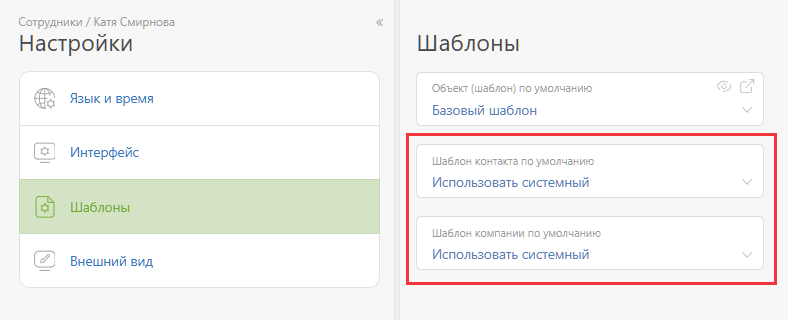

В [ настройках карточки сотрудника](Настройки_в_карточке_пользователя.md "Настройки в карточке пользователя") есть возможность выбрать [ шаблон](Шаблоны_контактов.md "Шаблоны контактов"), по которому он будет [ создавать контакты](Добавить_новый_контакт.md "Добавить новый контакт"). 

Настройка шаблона контакта/компании по умолчанию для сотрудника: 

## Важно

  * Настройка распространяется на создание контактов способами, которые не переопределяют шаблон. Например, создание контакта по кнопке **Создать** в главном меню.

  * Если же контакт создается в [фильтре контактов](Фильтры_контактов.md "Фильтры контактов") или списке [планировщика](Планировщик.md "Планировщик"), который содержит условие отбора по определенному шаблону контактов, то будет использоваться указанный в условии шаблон контакта, а шаблон контакта по умолчанию будет проигнорирован.

  * В окне создания контакта будет подставлен этот шаблон, но создающий контакт или компанию пользователь может изменить его на другой [доступный ему шаблон](Доступ_к_контактам.md "Доступ к контактам"), выбрав из списка.
