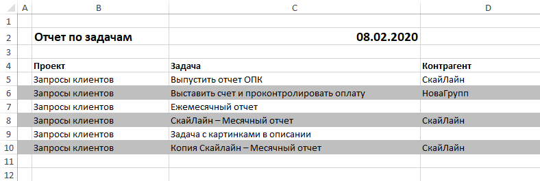
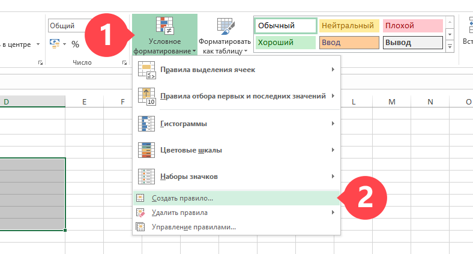
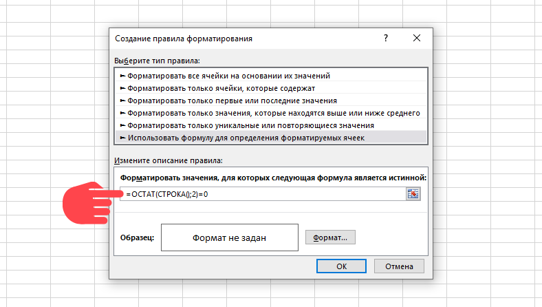
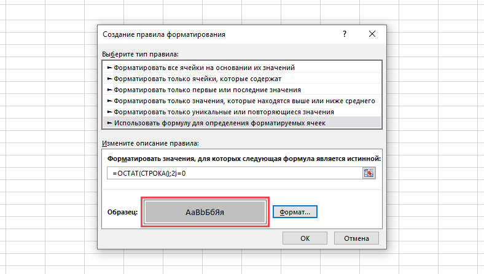

Вы можете применить [условное форматирование](https://support.office.com/ru-ru/article/%D0%9F%D1%80%D0%B8%D0%BC%D0%B5%D0%BD%D0%B5%D0%BD%D0%B8%D0%B5-%D1%86%D0%B2%D0%B5%D1%82%D0%B0-%D0%BA-%D1%87%D0%B5%D1%80%D0%B5%D0%B4%D1%83%D1%8E%D1%89%D0%B8%D0%BC%D1%81%D1%8F-%D1%81%D1%82%D1%80%D0%BE%D0%BA%D0%B0%D0%BC-%D0%B8%D0%BB%D0%B8-%D1%81%D1%82%D0%BE%D0%BB%D0%B1%D1%86%D0%B0%D0%BC-30002ce0-7a1c-4d70-a70c-4b6232f09f5e) в [шаблонах документов](Шаблоны_документов.md "Шаблоны документов") и [шаблонах экспорта данных из отчетов](Экспорт_данных_из_отчетов.md "Экспорт данных из отчетов") в формате Microsoft Excel, чтобы добиться выделение строк через одну нужным фоном: 

  

Порядок действий для получения такого эффекта: 

  * Откройте шаблон в MS Excel

  * Выделите строку с данными отчета или табличной части документа.

  * На вкладке "Главная" нажмите кнопку "Условное форматирование" — "Создать правило":

  

  * В списке "Выберите тип правила" выберите пункт "Использовать формулу для определения форматируемых ячеек".

  * В поле "Форматировать значения, для которых следующая формула является истинной" введите формулу =ОСТАТ(СТРОКА();2)=0

  

  * Нажмите кнопку "Формат" и в окне "Формат ячеек" откройте вкладку "Заливка".

  * Выберите желаемый цвет и нажмите "ОК". Выбранный цвет будет отображен в поле "Образец":

  

  * Нажмите "ОК" в этом окне для сохранения настроек.

  * Сохраните шаблон и загрузите его в ПланФикс.
