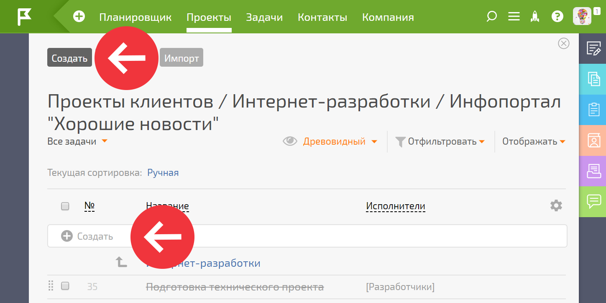

В рамках [ Проекта](Проекты.md "Проекты") можно задавать [ шаблон задачи](Шаблоны_задач.md "Шаблоны задач") по умолчанию, по которому будут создаваться задачи в данном проекте. 

Шаблоны задач в проектах по умолчанию используются: 

  * При создании задач в проекте при нажатии на кнопку **Создать** или в интерфейсе быстрого создания:

  

  * При отправке e-mail на [ адрес проекта](E-mail_адрес_проекта.md "E-mail адрес проекта").

  * При создании задач из чата [Telegram](Telegram.md "Telegram") при помощи бота ПланФикс.

## Как задать шаблон задачи по умолчанию в существующем Проекте

  * Через **Детали проекта** , указав [шаблон по умолчанию](Шаблоны_задач.md "Шаблоны задач") в развернувшейся боковой панели.

  * Через кнопку **Редактировать** в **Деталях проекта**. По кнопке откроется шаблон проекта, в нём необходимо перейти в раздел **Детали** и указать шаблон задачи по умолчанию.

## Как задать шаблон задачи по умолчанию при создании Проекта

  * При создании [ нового Проекта](Как_создать_проект_.md "Как создать проект?") можно сразу задать шаблон задачи по умолчанию в разделе "Детали".

## Важно

  * Если при создании Шаблона задачи вы указываете Проект, то этот Шаблон **не становится** шаблоном по-умолчанию в указанном Проекте.

  * Если в текущем Шаблоне задачи указан Проект, и в этом Проекте установлен шаблон задач по умолчанию, тогда при создании задач по текущему Шаблону будет использоваться шаблон задач по умолчанию из настроек Проекта.
