В [шаблонах документов](Шаблоны_документов.md "Шаблоны документов") можно использовать различные шрифты. Для их корректного отображения в документах на разных компьютерах рекомендуем учитывать следующие рекомендации: 

  * При формировании документа указывайте PDF-формат.

  * В шаблоне документа используйте шрифты из списка ниже.

## Шрифты шаблонов документов

  * Arial

    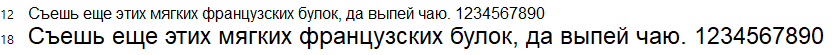

  

  * Courier New

    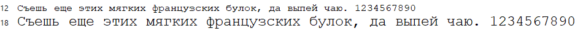

  

  * Calibri

    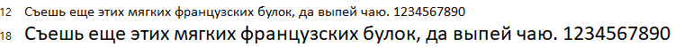

  

  * Georgia

    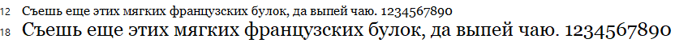

  

  * Tahoma

    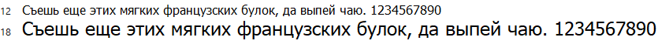

  

  * Times New Roman

    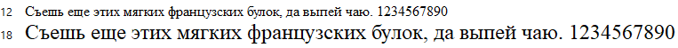

  

  * Verdana

    

  

  * RotondaС

    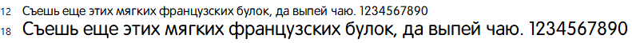

  

  * Exo 2

    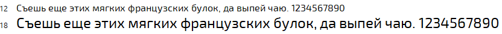

  

  * Cuprum

    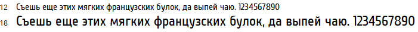

  

  * Segoe Script

    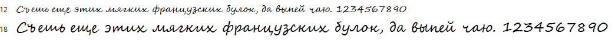

  

  * Mistral

    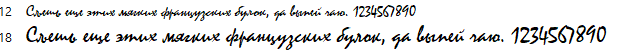

  

  * Lato

    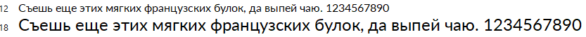

  

  * Roboto

    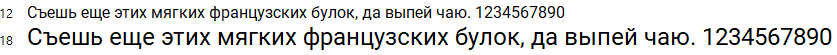

  

  * GOST type B

    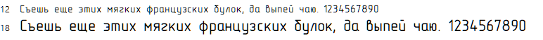

  

  * Lora

    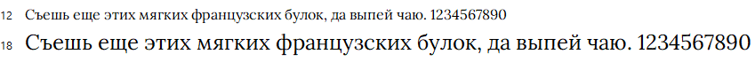
